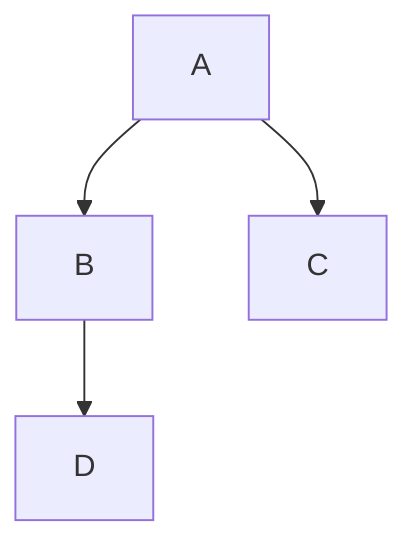
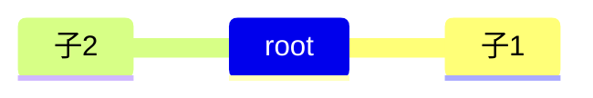
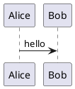

# （vuepress-theme-hope 增强组件示例集）

本页收集 `vuepress-theme-hope`（及其 `md-enhance` 插件）常用的增强组件和 Markdown 特性示例，便于在实验文档中复用。

--

## 目录

- 任务列表
- 图片
- 数学公式
- 导入文件（链接/包含）
- 幻灯片（简要）
- 脚注
- 选项卡
- 提示容器 / 警告 / 注释
- 上下角标、标记、自定义对齐、样式
- Chart.js / ECharts
- Mermaid / PlantUML / 思维导图 / 流程图
- 代码块、代码块分组、交互演示
- 配置与说明

---

## 任务列表

GFM 风格的任务列表：

- [x] 完成实验准备
- [ ] 实验一：数据采集
- [ ] 实验二：结果分析

> 注意：这是标准的 GitHub 风格任务列表，VuePress 支持渲染并保留复选框样式（但是状态非交互持久化，需配合自定义脚本）。

## 图片

（图片示例已移除）

## 数学公式

行内公式：这是行内公式 $E=mc^2$ 的示例。

块级公式：

$$
\nabla \cdot \mathbf{E} = \frac{\rho}{\varepsilon_0}
$$

（主题启用了 KaTeX，则可正常渲染；若未启用请在配置中开启。）

## 导入文件（链接或包含）

<!-- - 作为链接导入其他页面：[实验一 - Part2](./实验一/part2.md) -->
- 如果你使用 `markdown-it-include` 或类似插件，可以直接包含外部 md；否则可用短链接引用。

## 脚注

这是一段带脚注的文字。[1]

[1]: 这是脚注的示例内容。

## 选项卡（Tabs）

以下为选项卡示例（`md-enhance` 支持多种 Tabs 语法）：

::: tabs
@tab 前端

前端内容示例。

@tab 后端

后端内容示例。

:::

## 提示容器 / 注释 / 警告 / 详情

::: tip
这是一个 `tip`（提示）容器。
:::

::: info
信息容器，用于给出相关信息。
:::

::: warning
警告容器，表示需要注意的地方。
:::

::: danger
危险容器，表示风险或重要错误。
:::

::: details 更多信息
这里是可折叠的详情内容（剧透/折叠）。
:::

## 上下角标、标记、样式化

上标：H<sup>2</sup>O， 下标：CO<sub>2</sub>

标记（高亮）：==被高亮的文字==（若启用 highlight 功能）。

自定义对齐示例见上面的 `<div align="center">`。

你也可以为元素添加属性（如 `.class` 或 `#id`）的样式支持：

````markdown
段落内容{.my-class}
````

（需在主题/插件中启用属性支持）


## Mermaid / PlantUML / 思维导图 / 流程图

Mermaid（流程图）：



思维导图（Mermaid 的 mindmap）：



PlantUML 示例：



（注意：PlantUML 需要服务端支持或本地工具来渲染）

## 代码块、代码块分组、预览、交互演示

普通代码块：

```js
console.log('Hello, vuepress-hope!')
```

代码分组（示例使用 Tabs 来分组同一段代码的多语言实现）：

::: tabs
@tab JavaScript

```js
console.log('JS')
```

@tab Python

```py
print('Python')
```
:::

交互演示占位（`demo` / Sandpack / Kotlin / Vue）：

::: demo 使用 Vue demo
```vue
<template>
    <button @click="count++">点击 {{ count }}</button>
</template>

<script setup>
import { ref } from 'vue'
const count = ref(0)
</script>
```
:::

Sandpack 占位（若启用 Sandpack 支持）：

```sandpack
{"files": {"/App.js": "export default () => 'Hello'"}}
```

Kotlin 交互演示、外部引入或其他复杂交互请使用对应的插件或 iframe 嵌入。

## 其他 / 外部引入

- 你可以通过 `<iframe>` 或外部脚本引入第三方演示或可视化内容。

## 配置（简要）

下面示例展示如何在主题配置中启用或禁用部分功能（`0. theme.ts` 示例）：

```ts
import { hopeTheme } from 'vuepress-theme-hope'

export default hopeTheme({
    // ... 其他配置
    mdEnhance: {
        chart: true,
        echarts: true,
        mermaid: true,
        plantuml: true,
        // 启用属性、流程图、数学公式等
        attrs: true,
        flowchart: true,
        katex: true,
        presentation: true,
        demo: true,
        playground: true,
    },
})
```

示例中若某些块不渲染，请检查 `mdEnhance`（或 `markdown`）配置是否开启对应功能。


---

（示例结束）

---